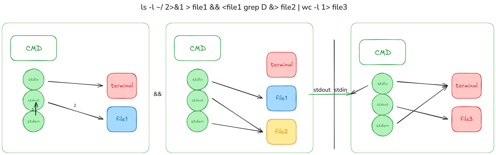
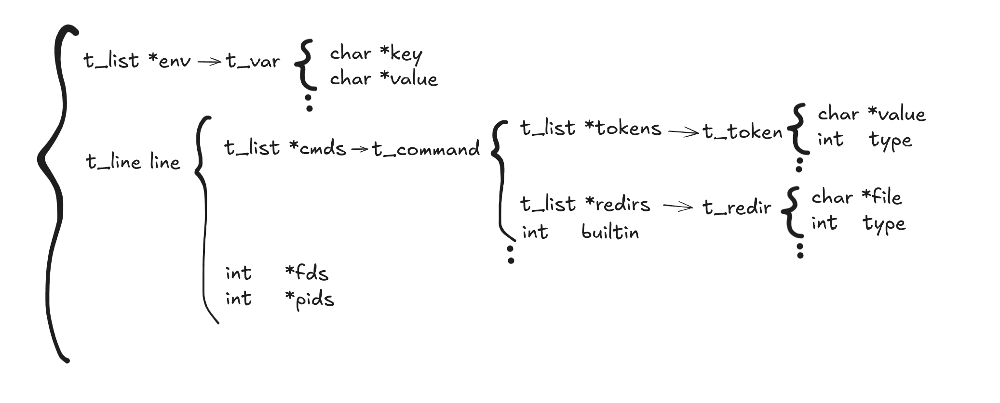

# minishell

A minimalist, POSIX-inspired Unix shell written in C — a 42 School project. `minishell` reads a line, parses it into an abstract syntax tree of commands, expands variables, sets up pipes and redirections, and executes the result. It mimics a subset of `bash` behavior while staying within the strict constraints of the 42 cursus (limited allowed functions, strict memory hygiene, `-Wall -Wextra -Werror`).

```
dyunta@host:/home/dyunta$ echo "hello $USER" | cat -e | tr a-z A-Z
HELLO DYUNTA$
```

---

## Table of contents

- [Features](#features)
- [Architecture](#architecture)
- [Project structure](#project-structure)
- [Build](#build)
- [Usage](#usage)
- [Built-ins](#built-ins)
- [Redirections and pipes](#redirections-and-pipes)
- [Expansions](#expansions)
- [Signals](#signals)
- [Allowed functions](#allowed-functions)
- [Credits](#credits)
- [License](#license)

---

## Features

- Interactive prompt with colored `user@host:cwd$` formatting backed by GNU `readline` (history included).
- Tokenizer / lexer aware of metacharacters (`| < > \t \n`) and quoting (single and double quotes with different expansion rules).
- Recursive-descent parser producing an AST of commands grouped per pipeline line.
- Variable expansion: `$VAR`, `$?` (last exit status), concatenation inside double quotes.
- Pipes (`|`) of arbitrary length.
- Redirections: `<`, `>`, `>>`, and heredocs (`<<`) — heredocs are materialized as temp files and cleaned up after use.
- Seven built-ins implemented from scratch: `cd`, `echo`, `env`, `exit`, `export`, `pwd`, `unset`.
- POSIX-ish signal handling with two modes (interactive vs. non-interactive) — `Ctrl-C`, `Ctrl-D`, and `Ctrl-\` behave like `bash`.
- `SHLVL` tracking and a safe-default environment when launched with `env -i`.
- AddressSanitizer and LeakSanitizer build targets for debugging.

---

## Architecture

A single line of user input flows through four stages: **lexer → parser → expander → executor**, with the persistent `t_data` core carrying environment and last exit status across iterations.

### Command flow



### Data structures



Core types (declared in `include/minishell.h`):

| Type        | Purpose                                                                |
| ----------- | ---------------------------------------------------------------------- |
| `t_data`    | Long-lived core: env list, current line, last errcode, saved std fds.  |
| `t_line`    | One pipeline: linked list of `t_command`, pipe fds, child pids.        |
| `t_command` | One command: token list, redirection list, per-command fds.            |
| `t_token`   | `{ value, type }` — `WORD`, `REDIRECTION`, `PIPE`, quoted variants.    |
| `t_redir`   | `{ file, type }` — `INPUT`, `OUTPUT`, `APPEND`, `HEREDOC`, `H_INPUT`.  |
| `t_var`     | Environment entry `{ key, value }` stored in a `t_list`.               |

---

## Project structure

```
.
├── Makefile                # Build, debug, asan, lsan targets
├── include/
│   └── minishell.h         # All public types and prototypes
├── libft/                  # Submodule — custom C standard helpers
├── notes/                  # Internal design notes and diagrams
└── src/
    ├── main.c              # REPL entry point
    ├── core/               # Init, env helpers, top-level loop
    ├── parser/             # Lexer, parser, AST, expansions, prompt
    ├── executor/           # Pipes, forks, redirs, heredoc, builtin dispatch
    ├── builtins/           # cd, echo, env, exit, export, pwd, unset
    ├── signals/            # Interactive/non-interactive signal modes
    └── utils/              # Free routines, error reporting, printers
```

---

## Build

### Requirements

- Linux or macOS with a C99 compiler (`cc`/`gcc`/`clang`)
- GNU `readline` development headers (`libreadline-dev` on Debian/Ubuntu, `readline` on Homebrew)
- GNU `make`
- `git` (for the `libft` submodule)

### Clone

```sh
git clone --recurse-submodules <repo-url> minishell
cd minishell
# If you forgot --recurse-submodules:
git submodule update --init --recursive
```

### Compile

```sh
make            # builds ./minishell
make debug      # builds ./dbg with debug symbols
make asan       # rebuilds with -fsanitize=address
make lsan       # rebuilds with -fsanitize=leak
make clean      # remove object files
make fclean     # remove objects, binary, and libft archive
make re         # fclean + all
```

The Makefile passes `-DHOSTNAME=\"$(hostname)\"` so the prompt shows your real machine name.

---

## Usage

```sh
./minishell
```

You get an interactive prompt. Run commands as you would in `bash`:

```sh
dyunta@host:/tmp$ ls -la | grep '^d' | wc -l
12
dyunta@host:/tmp$ export NAME="world"
dyunta@host:/tmp$ echo "hello $NAME — exit was $?"
hello world — exit was 0
dyunta@host:/tmp$ cat << EOF > greeting.txt
> hi $NAME
> EOF
dyunta@host:/tmp$ cat greeting.txt
hi world
```

Exit with `exit`, `Ctrl-D`, or `exit 42` to return a specific status.

---

## Built-ins

| Built-in | Notes                                                                                          |
| -------- | ---------------------------------------------------------------------------------------------- |
| `cd`     | Supports `cd`, `cd -`, `cd ~`, relative and absolute paths. Updates `PWD` and `OLDPWD`.        |
| `echo`   | Supports `-n` (no trailing newline).                                                           |
| `env`    | Prints only variables with a value (matching `bash` behavior).                                 |
| `exit`   | `exit`, `exit N`, validates numeric argument, errors on too many args.                         |
| `export` | `export`, `export VAR`, `export VAR=val`, multiple args. Lists with `declare -x` style output. |
| `pwd`    | Uses `getcwd`.                                                                                 |
| `unset`  | Removes one or more variables from the environment.                                            |

Built-ins are executed in the parent process when alone, and in the child process when part of a pipeline (so `cd` inside a pipe is a no-op for the parent, just like `bash`).

---

## Redirections and pipes

| Syntax        | Meaning                                                |
| ------------- | ------------------------------------------------------ |
| `cmd < file`  | Read stdin from `file`.                                |
| `cmd > file`  | Truncate `file` and write stdout to it.                |
| `cmd >> file` | Append stdout to `file`.                               |
| `cmd << EOF`  | Heredoc — read until line equal to `EOF`, feed stdin.  |
| `a \| b \| c` | Pipeline — stdout of each command feeds stdin of next. |

Multiple redirections on the same command are honored in order. Failed redirections short-circuit the command (e.g. `< nope ls > out` neither creates `out` nor runs `ls`).

---

## Expansions

- `$VAR` is expanded inside double quotes and in unquoted words.
- `'$VAR'` (single-quoted) is left literal.
- `$?` expands to the last command's exit status.
- Adjacent expansions concatenate: `echo $USER$HOME` works as expected.
- Unset variables expand to the empty string.

---

## Signals

Two modes are wired through `signal_handler(t_shell_mode)`:

- **Interactive (`INTER`)** — at the prompt: `Ctrl-C` redraws a fresh prompt, `Ctrl-\` is ignored, `Ctrl-D` on an empty line exits the shell.
- **Non-interactive (`NONIN`)** — while a child is running: signals propagate naturally so the child can be interrupted without killing the shell.

---

## Allowed functions

Per the 42 subject, only this whitelist of libc / readline / system calls is used (see [`notes/allowed_functions.md`](notes/allowed_functions.md) for the full list): `readline`, `add_history`, `printf`, `malloc`/`free`, `write`/`read`/`open`/`close`/`access`/`unlink`, `fork`/`wait`/`waitpid`, `signal`/`sigaction`/`kill`, `exit`, `getcwd`/`chdir`/`stat`/`lstat`/`fstat`, `execve`, `dup`/`dup2`/`pipe`, `opendir`/`readdir`/`closedir`, `strerror`/`perror`, `isatty`/`ttyname`/`ttyslot`, `ioctl`, `getenv`, `tcsetattr`/`tcgetattr`, terminfo `tgetent`/`tgetflag`/`tgetnum`/`tgetstr`/`tgoto`/`tputs`.

---

## Credits

- **[kde-la-c](https://github.com/kde-la-c)** — original co-author at 42 Madrid.
- **[dyunta](https://github.com/viodid) (David Yunta)** — co-author and maintainer.
- `libft/` is pulled in as a git submodule from [`kde-la-c/libft`](https://github.com/kde-la-c/libft).

---

## License

Released under the MIT License — see [LICENSE](LICENSE).
